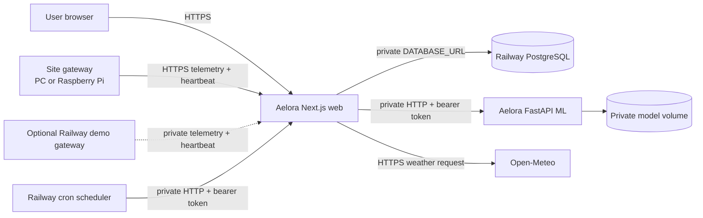

# Aelora deployment: A–Z Railway guide

> New to deployment? Use
> [Deploy Aelora from zero: beginner step-by-step guide](BEGINNER_DEPLOYMENT_GUIDE.md)
> first. This document is the more detailed operational reference.

This runbook deploys Aelora as a four-service core system and normally keeps the
virtual or physical gateway at the solar installation. An optional protected
Railway-hosted virtual gateway is supported for classroom showcases only.

## 1. Target architecture



Only `aelora-web` receives a public domain in the normal architecture.
PostgreSQL and `aelora-ml` stay private. A site gateway needs outbound HTTPS but
no public inbound port. The optional demo gateway may expose a separately
authenticated HTTPS console; it reaches the web service over Railway's private
network.

The scheduler starts every 15 minutes, calls telemetry roll-ups and the
intelligence refresh, then exits. The intelligence endpoint applies the
application's freshness rules: weather is stored before inference and a fresh
forecast is not recomputed unnecessarily.

## 2. Files already prepared

### Aelora web repository

- `Dockerfile`: multi-stage, non-root Next.js standalone image.
- `.dockerignore`: excludes secrets, tests, evidence, and local build output.
- `app/api/health/route.ts`: database-backed readiness endpoint.
- `scripts/bootstrap-admin.ts`: idempotent one-time production admin bootstrap.
- `ops/scheduler/Dockerfile` and `run.mjs`: short-lived authenticated cron job.
- `.github/workflows/ci.yml`: lint, types, tests, migration, scheduler, and build.

### ML repository

- `Dockerfile`: non-root FastAPI image using Railway's `PORT`.
- The model binary is intentionally not stored in Git. It is loaded from
  `/model-artifacts/unisolar_capacity_candidate_v3.skops`.
- `/health` proves the process is alive; `/ready` proves the checksum-verified
  model is loaded.
- `.github/workflows/ci.yml`: Ruff, pytest/coverage, dependency and package checks.

### Virtual gateway repository

- `Dockerfile` and `compose.yaml`: portable site-gateway deployment.
- SQLite state is persisted in the `gateway-data` Docker volume.
- Only `127.0.0.1:4100` is exposed on the site computer.
- Optional public-demo mode protects all console/control paths with separate
  browser credentials while leaving `/api/health` available to Railway.
- Railway's injected `PORT` is preferred when hosted.
- `/api/health` is independent of enrollment and cloud availability.
- `.github/workflows/ci.yml`: Ruff, pytest/coverage, and dependency checks.

## 3. Accounts and local prerequisites

Install or prepare:

1. A GitHub account with the existing web, ML service, and virtual gateway repositories.
2. A Railway account with billing/cost limits configured.
3. Git and Node.js 22 on the deployment operator computer.
4. Railway CLI on Windows:

   ```powershell
   npm install --global @railway/cli
   railway login
   ```

5. Docker Desktop only if the gateway will run in Docker. The web and ML images
   are built by Railway, so local Docker is not required for cloud deployment.
6. A password manager for the generated secrets.

Do not use the local PostgreSQL password `1234` in Railway. Railway generates a
different database password and exposes it through a reference variable.

## 4. Put all three projects on GitHub

All three repositories now have GitHub remotes:

- `https://github.com/GoyumX/Aelora`
- `https://github.com/GoyumX/aelora-ml-service`
- `https://github.com/GoyumX/aelora-virtual-gateway`

Their current deployable work is on `dev`. Use the beginner guide to deploy
`dev` first, then move Railway to reviewed `main` branches after the first
acceptance pass. Require the included GitHub Actions workflows to pass before
merging. Never add `.env`, the `.skops` model artifact, the gateway SQLite
database, or downloaded datasets to Git.

## 5. Generate production secrets

Run the following PowerShell expression separately three times and save each
result under the indicated name:

```powershell
$secretBytes = New-Object byte[] 48
[Security.Cryptography.RandomNumberGenerator]::Fill($secretBytes)
[Convert]::ToBase64String($secretBytes)
```

Generate independent values for:

- `BETTER_AUTH_SECRET`
- `WEATHER_SYNC_SECRET`
- `AELORA_ML_INTERNAL_API_TOKEN`

Choose a different, unique password of at least 16 characters for
`BOOTSTRAP_ADMIN_PASSWORD`. Do not paste any of these values into source files,
screenshots, logs, issues, or this guide.

## 6. Create the Railway project and PostgreSQL

1. In Railway, create an **Empty Project** named `Aelora`.
2. Use **New → Database → PostgreSQL**.
3. Rename the database service to `postgres`.
4. Open its **Backups** tab and enable at least daily and weekly volume backups.
5. Do not create a public TCP proxy for normal application traffic.

The web service will reference `${{postgres.DATABASE_URL}}`; no database
password is copied manually.

## 7. Deploy the private ML service

1. Add a service from the `aelora-ml-service` GitHub repository and production
   branch. Name the service `aelora-ml`.
2. Do **not** generate a public domain.
3. Attach a volume named `aelora-ml-models` at `/model-artifacts`.
4. Add these service variables:

   ```text
   PORT=8000
   AELORA_ML_INTERNAL_API_TOKEN=<generated ML token>
   AELORA_ML_MODEL_METADATA_PATH=/app/models/unisolar_capacity_candidate_v3.metadata.json
   AELORA_ML_MODEL_ARTIFACT_PATH=/model-artifacts/unisolar_capacity_candidate_v3.skops
   ```

5. In **Settings → Deploy**, set:

   ```text
   Healthcheck path: /ready
   Healthcheck timeout: 300 seconds
   Restart policy: On Failure
   Maximum retries: 5
   ```

6. The first deployment can remain unready while the new volume is empty. Link
   the Railway CLI to the project, then upload the ignored model artifact:

   ```powershell
   cd C:\Users\GoYuM\Documents\ChatGPT\Aelora\Project\aelora-ml-service
   railway link
   railway volume list
   railway volume files --volume aelora-ml-models upload `
     .\models\unisolar_capacity_candidate_v3.skops `
     /unisolar_capacity_candidate_v3.skops
   railway volume files --volume aelora-ml-models list /
   ```

7. Confirm the local file before upload:

   ```powershell
   (Get-FileHash .\models\unisolar_capacity_candidate_v3.skops -Algorithm SHA256).Hash.ToLower()
   ```

   Expected SHA-256:

   ```text
   bdb71b6e0436204d1cf33a9118d1e40c28052073512eb571ab4174cbefb65fd9
   ```

8. Redeploy `aelora-ml`. `/ready` must become healthy. Keep it private; the web
   service reaches it at `http://aelora-ml.railway.internal:8000`.

The current artifact metadata is `CHALLENGER_NOT_ACTIVE` with
`production_activation_allowed: false`. It is suitable for this research/demo
deployment, but the UI and report must not claim it is a commercially validated
Sri Lankan production model.

## 8. Deploy the public Next.js web service

1. Add a service from the Aelora web GitHub repository and production branch.
   Name it `aelora-web`.
2. Under **Networking**, generate a Railway domain. Record the complete HTTPS
   URL, for example `https://aelora-web-production.up.railway.app`.
3. Add these variables. Use Railway's reference-variable picker for the first:

   ```text
   PORT=3000
   DATABASE_URL=${{postgres.DATABASE_URL}}
   BETTER_AUTH_SECRET=<generated Better Auth secret>
   BETTER_AUTH_URL=https://YOUR-AELORA-DOMAIN
   WEATHER_SYNC_SECRET=<generated scheduler secret>
   AELORA_ML_BASE_URL=http://aelora-ml.railway.internal:8000
   AELORA_ML_INTERNAL_API_TOKEN=<the exact same ML token as aelora-ml>
   BOOTSTRAP_ADMIN_EMAIL=your-real-admin-email@example.com
   BOOTSTRAP_ADMIN_NAME=Your Name
   BOOTSTRAP_ADMIN_USERNAME=your-admin-username
   BOOTSTRAP_ADMIN_PASSWORD=<unique admin password>
   ```

4. Seal secret variables where Railway offers the option.
5. In **Settings → Deploy**, configure:

   ```text
   Pre-deploy command: npm run db:deploy
   Healthcheck path: /api/health
   Healthcheck timeout: 300 seconds
   Restart policy: On Failure
   Maximum retries: 5
   ```

6. Railway will detect the repository-root `Dockerfile`. Deploy the staged
   changes. The pre-deploy command applies only committed Prisma migrations; it
   does not load the large development seed dataset.
7. Verify:

   ```powershell
   Invoke-RestMethod https://YOUR-AELORA-DOMAIN/api/health
   ```

   Expected status is `ok` and database check is `ok`.

## 9. Create the first administrator safely

Run the bootstrap inside the deployed web container so it can reach private
PostgreSQL:

```powershell
railway ssh --service aelora-web -- npm run admin:bootstrap
```

The command creates the account only if it is missing, promotes it to `ADMIN`,
reactivates it if needed, and never prints the password. Run it a second time to
confirm idempotence. Then remove `BOOTSTRAP_ADMIN_PASSWORD` from the web service
variables and redeploy. Retain the email/name/username only if you want an audit
reference; they are not needed at runtime.

Open `https://YOUR-AELORA-DOMAIN/sign-in` and sign in with the new account.

## 10. Deploy the scheduler

The scheduler is a second Railway service built from the web repository.

1. Add the same web GitHub repository again and name this service
   `aelora-scheduler`.
2. Set **Root Directory** to `/ops/scheduler`.
3. Confirm Railway detects `/ops/scheduler/Dockerfile`.
4. Do not add a public domain, database, volume, or healthcheck.
5. Add variables:

   ```text
   AELORA_WEB_INTERNAL_URL=http://aelora-web.railway.internal:3000
   WEATHER_SYNC_SECRET=<the exact same scheduler secret as aelora-web>
   ```

6. In **Settings → Cron Schedule**, enter:

   ```text
   */15 * * * *
   ```

7. Set restart policy to **Never**. A cron execution must call the two routes and
   terminate. Railway cron expressions use UTC; this particular expression is
   every 15 minutes in every timezone.
8. Deploy once and inspect logs. Both paths should complete and no bearer token
   should appear:

   ```text
   /api/internal/telemetry-rollups
   /api/internal/intelligence-refresh
   ```

## 11. Preserve the Railway project as supported IaC

Do not start a new service with `railway.toml`: Railway deprecated that format
for new services in 2026. After the dashboard deployment works, pull the actual
project identities and settings into the supported project-level TypeScript IaC:

```powershell
cd C:\Users\GoYuM\Documents\ChatGPT\Aelora\Project\aelora
railway link
railway config init
railway config pull
railway config plan
```

Review the generated `.railway/railway.ts` carefully, ensure it contains no
literal secret values, then commit it. Use `railway config plan` before every
future `railway config apply`. The initial dashboard setup is intentional:
resource IDs do not exist until your Railway project and services exist.

## 12. Run the virtual gateway at the site

The gateway is not another Railway service. It runs next to the simulated or
real equipment so communication loss is observable.

### Docker method

1. Install Docker Desktop on the site computer.
2. Create `.env` from `.env.example`:

   ```powershell
   cd C:\Users\GoYuM\Documents\ChatGPT\Aelora\Project\aelora-virtual-gateway
   Copy-Item .env.example .env
   ```

3. Set only the public web URL initially:

   ```text
   AELORA_BASE_URL=https://YOUR-AELORA-DOMAIN
   AELORA_GATEWAY_HOST=127.0.0.1
   AELORA_GATEWAY_PORT=4100
   AELORA_GATEWAY_DB=data/gateway.db
   AELORA_GATEWAY_RELOAD=false
   ```

   Docker Compose overrides the host and database path internally while keeping
   the console bound to local loopback externally.

4. Start it:

   ```powershell
   docker compose up --build -d
   docker compose ps
   docker compose logs --follow gateway
   ```

5. Open `http://127.0.0.1:4100` on that computer.

### Native Python method

```powershell
cd C:\Users\GoYuM\Documents\ChatGPT\Aelora\Project\aelora-virtual-gateway
.\.venv\Scripts\python.exe -m pip install -e .
$env:AELORA_BASE_URL = "https://YOUR-AELORA-DOMAIN"
$env:AELORA_GATEWAY_HOST = "127.0.0.1"
$env:AELORA_GATEWAY_PORT = "4100"
$env:AELORA_GATEWAY_DB = "data/gateway.db"
.\.venv\Scripts\python.exe -m aelora_virtual_gateway
```

Keep the terminal open. If the site computer sleeps, shuts down, or loses the
internet, Aelora will correctly stop receiving heartbeats and mark equipment
offline after its stale threshold.

### Optional hosted showcase method

For an undergraduate presentation, deploy the gateway repository as a fifth
Railway service named `aelora-demo-gateway`. This is a simulator-only
alternative to the site-computer methods above.

Required Railway variables:

```text
AELORA_BASE_URL=http://${{aelora-web.RAILWAY_PRIVATE_DOMAIN}}:3000
AELORA_GATEWAY_HOST=0.0.0.0
AELORA_GATEWAY_DB=/app/data/gateway.db
AELORA_GATEWAY_RELOAD=false
AELORA_GATEWAY_PUBLIC_DEMO=true
AELORA_GATEWAY_CONSOLE_USERNAME=REPLACE_WITH_DEMO_USERNAME
AELORA_GATEWAY_CONSOLE_PASSWORD=REPLACE_WITH_RANDOM_PASSWORD_AT_LEAST_16_CHARACTERS
```

Do not define `PORT`; Railway injects it. Attach one persistent volume at
`/app/data`, configure `/api/health`, use one replica, disable Serverless during
the presentation, and generate a public domain. The public URL must show the
browser authentication prompt. Follow the gateway repository's
[full hosted demo guide](https://github.com/GoyumX/aelora-virtual-gateway/blob/dev/docs/RAILWAY_HOSTED_DEMO.md)
for exact beginner steps, verification, demonstration flow, and cleanup.

## 13. Enroll and connect the gateway

1. Sign in to Aelora as admin or the site owner.
2. Open **System configuration** and select the correct solar site.
3. Create a gateway enrollment token. Copy it once; treat it as a secret.
4. Open the local gateway console at `http://127.0.0.1:4100`.
5. Paste the enrollment token and enroll.
6. Set publishing to 30 or 60 seconds and use **Publish now** for the first test.
7. Confirm the web app shows gateway, arrays, inverter, battery, and grid online.
8. Turn communications off for one virtual device. Its data should stop and the
   web app should eventually show that device offline without pretending the
   physical plant itself stopped producing.
9. Restore communications and verify heartbeat/telemetry recovery.

The enrollment response gives the gateway an ID, credential, heartbeat route,
and telemetry route. Later physical adapters should write the same normalized
gateway contract; the web application does not need to know each vendor's local
protocol.

## 14. End-to-end acceptance checklist

Complete every item before calling the deployment production-ready:

- [ ] GitHub CI is green for web, ML, and gateway.
- [ ] `GET /api/health` returns 200 and database `ok`.
- [ ] ML `/ready` is green and its artifact SHA matches the metadata.
- [ ] ML and PostgreSQL have no public application domain.
- [ ] Admin can sign in; normal user cannot open admin routes.
- [ ] Location saved in Settings drives stored Open-Meteo weather.
- [ ] Manual weather refresh succeeds.
- [ ] Scheduler logs show both private jobs every 15 minutes.
- [ ] The AI forecast has a new generated timestamp after a permitted refresh.
- [ ] Gateway enrollment, heartbeat, and telemetry are accepted over HTTPS.
- [ ] Dashboard/live monitoring update after new telemetry.
- [ ] Pausing publishing causes an offline indication after the stale threshold.
- [ ] Restarting the gateway retains enrollment and equipment in its Docker volume.
- [ ] Daily/weekly PostgreSQL backups are enabled.
- [ ] A logical `pg_dump` and isolated restore drill have been completed.
- [ ] Railway spending alerts or hard limits are configured.
- [ ] No `.env`, tokens, passwords, datasets, SQLite files, or model binary exist in Git.

## 15. Release flow after the first deployment

Use this sequence for every feature or fix:

1. Create a short-lived branch from `dev`.
2. Implement and run repository checks locally.
3. Merge the feature branch into `dev`.
4. Open a pull request from `dev` to `main`.
5. Require CI to pass and review migration/security changes.
6. Merge to `main`; Railway auto-deploys the connected production branch.
7. Watch pre-deploy, healthcheck, scheduler, and application logs.
8. Run the smoke checklist.
9. Roll back the application deployment if needed. Do not reverse a database
   migration blindly; restore from a tested backup or ship a forward fix.

Enable Railway's **Wait for CI** option for GitHub autodeploys so a failing
workflow cannot become the production deployment.

## 16. Backup and recovery

Use three layers:

1. Railway scheduled volume backups for routine recovery.
2. Point-in-time recovery if available on the selected plan.
3. Portable `pg_dump` archives stored outside the Railway project.

At least once per month, restore a dump to a scratch database and record:

- backup timestamp;
- restore start/end time;
- schema migration version;
- row-count comparison;
- tester and result.

Deleting a Railway project or volume can also delete same-project backups, so
offsite logical dumps remain necessary.

## 17. Troubleshooting

| Symptom | Check | Fix |
| --- | --- | --- |
| Web health is 503 | Web logs and `DATABASE_URL` reference | Select `${{postgres.DATABASE_URL}}`, redeploy, verify migrations |
| Migration command not found | Web image/package dependencies | Confirm `prisma` remains a production dependency and rebuild |
| ML health is green but readiness is 503 | Volume, artifact path, checksum | Upload the exact `.skops`, confirm mount `/model-artifacts`, redeploy |
| Web cannot call ML | Service name, port, token | Use `http://aelora-ml.railway.internal:8000` and identical tokens |
| Scheduler gets 401 | `WEATHER_SYNC_SECRET` mismatch | Replace both values with the same generated secret and redeploy |
| Scheduler stays running | Wrong service image/start command | Set root `/ops/scheduler`; it must run `node run.mjs` and exit |
| Auth redirects to localhost | `BETTER_AUTH_URL` | Set the exact deployed HTTPS origin and redeploy |
| Gateway says Aelora unreachable | URL, internet, TLS, firewall | Use the web public HTTPS origin; allow outbound 443 |
| Gateway becomes new after restart | Missing Docker volume | Keep `gateway-data:/app/data`; do not use `docker compose down -v` |
| Devices remain offline | Publishing/device communications | Resume publishing, enable device communications, publish now |
| Weather/forecast is stale | Scheduler logs/site location | Save valid coordinates, run manual refresh, inspect intelligence job logs |

## 18. Official references

- Railway private networking: <https://docs.railway.com/networking/private-networking>
- Railway cron jobs: <https://docs.railway.com/cron-jobs>
- Railway healthchecks: <https://docs.railway.com/deployments/healthchecks>
- Railway pre-deploy commands: <https://docs.railway.com/deployments/pre-deploy-command>
- Railway PostgreSQL: <https://docs.railway.com/databases/postgresql>
- Railway volumes and file upload: <https://docs.railway.com/cli/volume>
- Railway Serverless mode: <https://docs.railway.com/deployments/serverless>
- Railway backup/restore: <https://docs.railway.com/guides/postgres-backups-restores>
- Railway Infrastructure as Code CLI: <https://docs.railway.com/cli>
- Next.js self-hosting: <https://nextjs.org/docs/app/guides/self-hosting>
- Next.js standalone output: <https://nextjs.org/docs/app/api-reference/config/next-config-js/output>
