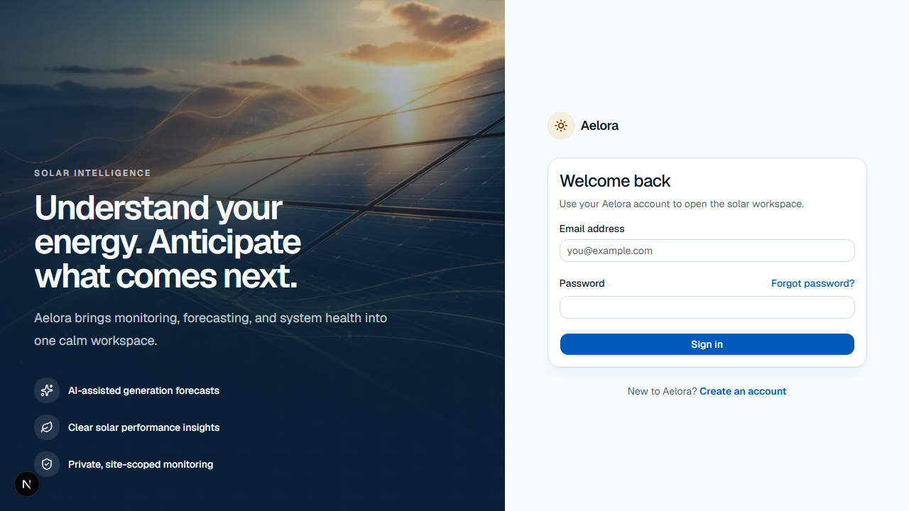
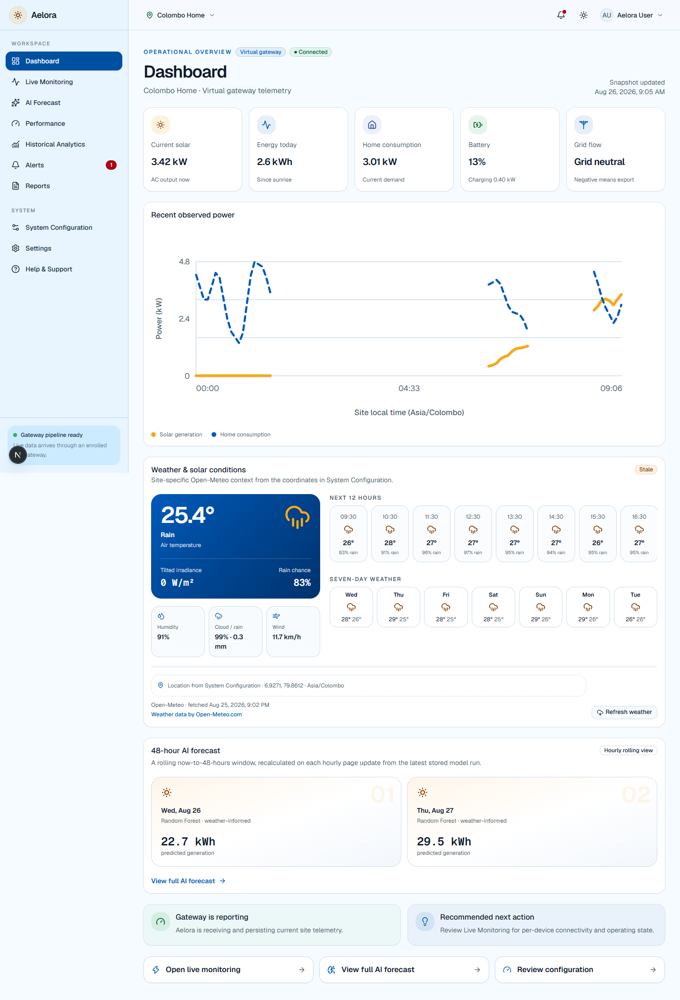
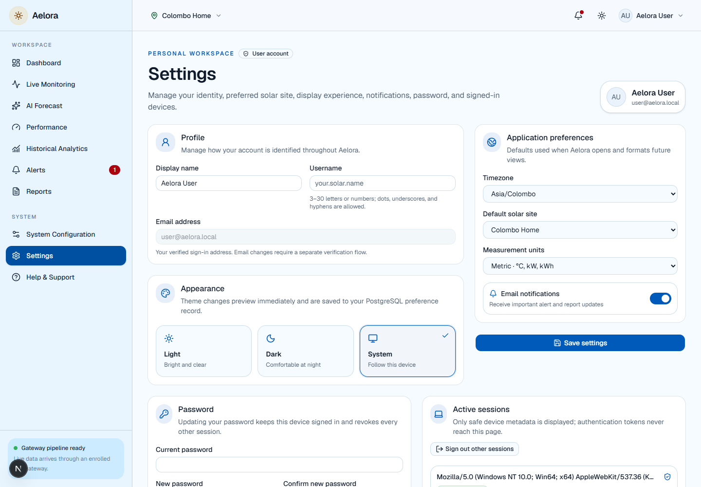
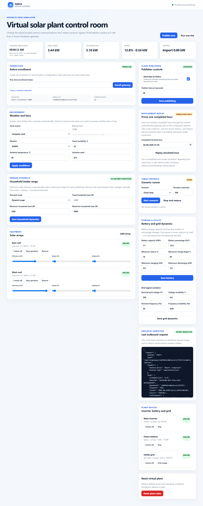

# Step 27 screenshot evidence pack

These images were captured automatically by
`e2e/documentation-evidence.spec.ts` from successful local browser journeys.
They contain no passwords, bearer tokens, or private gateway credentials.

## Chapter 6 - Implementation figures

### Figure 6.x - Secured Aelora authentication boundary

The sign-in screen demonstrates the public authentication boundary and the
responsive visual identity. Its successful browser response included a unique
nonce-based Content Security Policy.

### Figure 6.x - Protected monitoring dashboard

The authenticated dashboard demonstrates site-scoped telemetry, gateway
connectivity, five-minute display aggregation, weather context, and stored AI
forecast output within the common application shell.

### Figure 6.x - Profile and session security settings

The Settings workspace demonstrates profile preferences, password change,
theme controls, active-session visibility, and session revocation controls.

### Figure 6.x - Separately runnable virtual-site gateway

The gateway control room demonstrates the external telemetry producer,
enrollment state, publishing cadence, environment and demand controls, virtual
equipment, scenario runner, redacted request inspector, and device status.

## Chapter 7 - Testing use

The screenshots are backed by a three-test Playwright capture suite. The same
full browser run passed 25 tests across public, user, and administrator routes.
Use `docs/testing/security-hardening.tdd.md` for RED/GREEN, HTTP status,
coverage, vulnerability scan, and regression-test evidence.
